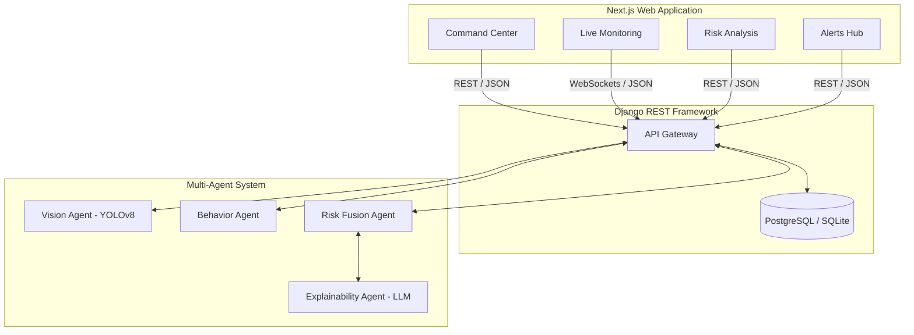
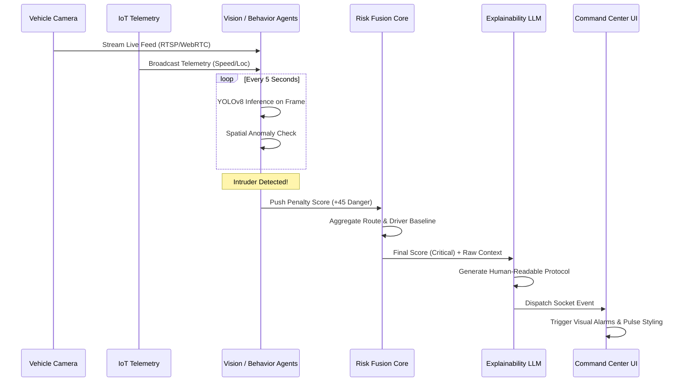
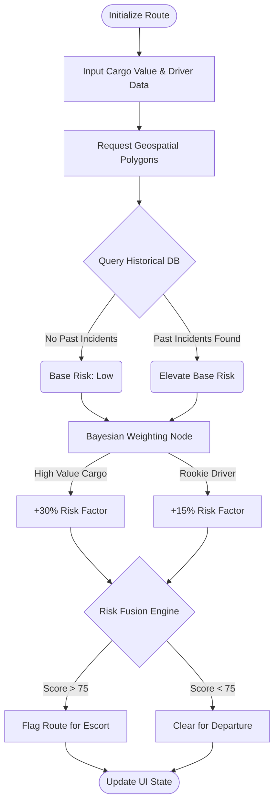

# RAKSHAK AI

RAKSHAK AI is an intelligent surveillance and telemetry platform designed for high-value fleet monitoring. It merges real-time GPS tracking, computer vision (YOLOv8), and multi-agent AI risk analysis to provide preemptive intelligence, actionable insights, and centralized operational command.

## System Architecture

The overarching architecture relies on a decoupled client-server model, ensuring the AI inference engine can scale independently of the client-facing telemetry dashboards.



## Features Deep-Dive

### 1. Command Center Dashboard
The primary operations hub. It visualizes aggregate fleet health, active consignment status, and system-wide risk through highly optimized, auto-refreshing UI components.
*   **Spatial Mapping:** Integrates dynamic routing and fleet plotting natively within the UI using Leaflet.
*   **Telemetry Grids:** Displays constant variable feeds (speed, engine status, location) mapped against real-time baseline anomalies.
*   **Terminal Interface:** Uses specialized typography and CSS compositing to deliver a high-contrast, distraction-free environment for human operators.

### 2. Live Platform Monitoring
A dedicated pre-journey and mid-journey surveillance interface.
*   **Vision AI Integration:** Processes camera feeds to detect structural anomalies, unauthorized personnel, or package tampering via specific YOLO model bindings.
*   **Staggered Reporting:** Risk reports are generated sequentially as data streams arrive, maintaining operator focus on critical changes rather than static logs.

### 3. Predictive Risk Analysis Engine
A robust Bayesian model interface used for route and cargo planning.
*   **Physical Gauges:** Integrates dynamic vector graphics tied to spring-physics engines to display output scores.
*   **Driver & Route Evaluation:** Weighs historical safety metadata against cargo value and live weather/traffic conditions to output a holistic danger index.
*   **Cascading History:** Archives past predictions allowing operations to review and adjust parameters on the fly.

### 4. Alert Intelligence Center
An automated triage system for incoming anomalies.
*   **Priority Filtering:** Sorts alerts categorically (Critical, High, Medium, Low) and instantly surfaces the highest operational danger.
*   **Explainable AI (XAI):** Rather than outputting binary thresholds, the LLM Explainability Agent synthesizes localized data into a human-readable threat summary.
*   **Recommended Actions:** Instantly proposes predefined security protocols (e.g., "Dispatch Rapid Response", "Notify Convoy Leader") based on the fused penalty vectors of the trigger event.

## Multi-Agent AI Workflow

The backend utilizes an isolated agent structure to prevent processing bottlenecks:
*   **Vision Agent:** Intercepts raw frame data, processing YOLOv8 instances and returning base risk penalties.
*   **Behavior Agent:** Evaluates sequential GPS logs and telemetry against historical norms using isolation forests to flag hijackings or abnormal stops.
*   **Risk Fusion Agent:** The core orchestration brain. It merges spatial risk from routes, vision penalties, and behavior deviations into a finalized scoring metric.
*   **Decision / Explainability Agent:** Translates the raw numeric penalty vectors from the Fusion agent into textual actions broadcasted to the frontend or notification APIs.

## System Workflows & Pipelines

### 1. Vision AI & GPS Triage Event Loop

This sequence illustrates the lifecycle of a physical threat detected by the onboard hardware during an active trip.



### 2. Bayesian Pre-Journey Route Analysis

This flowchart maps how logistics coordinators utilize the predictive engine before a truck ever leaves the facility.



## Setup & Installation

### 1. Backend Integration (Django + Python AI Core)

The backend hosts the API interfaces, database schemas, and the LangGraph/PyTorch execution environments.

**Prerequisites:** Python 3.10+, standard build tools.

```bash
# Navigate to backend directory
cd backend

# Create isolated execution environment
python -m venv venv
# Windows: venv\Scripts\activate
# Unix/MacOS: source venv/bin/activate

# Install compiled ML dependencies and REST frameworks
pip install -r requirements.txt

# Provision database schemas (Trucks, Trips, GPSLogs, Alerts)
python manage.py makemigrations
python manage.py migrate

# Initialize the local API server
python manage.py runserver
```

Reference the `backend/API_REFERENCE.md` and `backend/AI_CONTRACT.md` for exact integration parameters. Once active, the API will bind to `http://localhost:8000/`.

### 2. Frontend Application (Next.js)

The frontend leverages React 19, Next.js 16 (Turbopack), and Framer Motion for a fluid, hardware-accelerated monitoring experience.

**Prerequisites:** Node.js 18.17+

```bash
# Navigate to frontend directory
cd frontend

# Hydrate node_modules dependencies
npm install

# Initialize the Turbopack compiler
npm run dev
```

Build processes natively optimize images and components. The frontend UI will initialize on `http://localhost:3000/`.